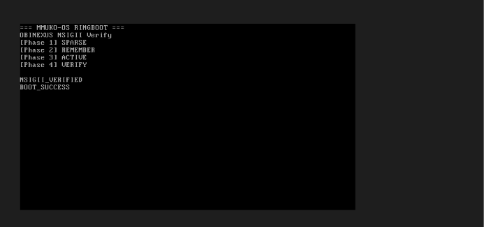

# MMUKO-OS Boot System

**OBINEXUS NSIGII-Verified Bootloader with Interdependency Tree Hierarchy**

A quantum-inspired operating system bootloader implementing stateless ring boot with non-deterministic finite automaton verification and interdependency resolution.

## Overview

MMUKO-OS (M for Mike, U for Uniform, K for Kilo, O for Oscar) is a multi-language boot system featuring:

- **NSIGII Protocol**: Trinary verification (YES/NO/MAYBE)
- **Interdependency Tree**: Hierarchical dependency resolution (A→B→C)
- **Quantum State Model**: 8 qubits with half-spin (π/4) allocation
- **Ring Boot State Machine**: SPARSE → REMEMBER → ACTIVE → VERIFY
- **RIFT Header**: 8-byte verification header with checksum
- **Multi-Language Support**: C, C++, C# implementations

In the OBINexus vocabulary, **MMUKO** names the spirits of good and evil that
bind us all in the digital world. MMUKO-OS treats that language as a
constitutional human-rights operating-system model: boot is not only loading
bytes, but proving that identity, memory, device state, and execution permission
have passed NSIGII verification.

OBIELF is the heart-and-soul executable/linkable artifact layer for this work.
MMUKO-OS boots with `mmuko-boot` and packages boot artifacts through OBIELF as
executable-first outputs that can later become linkable objects, static
libraries, dynamic libraries, or metadata manifests as the OBIELF linker/loader
specification matures.

## Project Structure

```
mmuko-os/
├── img/
│   └── mmuko-os.img          # 512-byte bootable image
├── include/
│   └── mmuko_types.h         # Core type definitions
├── src/
│   ├── boot_sector.asm       # x86 assembly boot sector
│   ├── mmuko_boot.c          # Main boot sequence
│   ├── interdependency.c     # Tree resolution system
│   └── obiboot.c/h           # Legacy boot support
├── boot/
│   ├── kernel.c              # QEMU freestanding MMUKO boot kernel
│   ├── mmuko_boot.psc        # PSC source model for MMUKO boot phases
│   ├── build-direct.ps1      # Windows-friendly direct boot image build
│   └── Makefile              # Imported boot build targets
├── cpp/
│   ├── riftbridge.hpp        # C++ interface
│   └── riftbridge.cpp        # C++ implementation
├── csharp/
│   └── RiftBridge.cs         # C# .NET implementation
├── examples/
│   ├── trident-boot/         # Static HTML/Canvas NSIGII trident visualizer
│   └── lt-fileformat/        # Go LTF/NSIGII codec example
├── build.sh                  # Main build script
├── ringboot.sh               # VirtualBox test script
└── README.md                 # This file
```

## Core Concepts

### NSIGII Verification States

```c
#define NSIGII_YES   0x55  // Boot verified (01010101)
#define NSIGII_NO    0xAA  // Boot failed (10101010)
#define NSIGII_MAYBE 0x00  // Pending verification
```

### Interdependency Tree Hierarchy

The boot sequence uses a tree structure for dependency resolution:

```
ROOT (0) - System initialization
  └── TRUNK (1) - Memory Manager
        ├── BRANCH (2) - Interrupt Handler
        │     └── LEAF (3) - Timer Service
        ├── BRANCH (4) - Device Manager
        │     └── LEAF (5) - Console Service
        └── BRANCH (6) - File System
              └── LEAF (7) - Boot Loader
```

Resolution order: Leaf → Branch → Trunk → Root (bottom-up)

### Quantum Spin Model

8 qubits representing compass directions with half-spin allocation:

| Qubit | Direction | Angle | State |
|-------|-----------|-------|-------|
| 0 | North | 0° | SPARSE |
| 1 | Northeast | π/4 | REMEMBER |
| 2 | East | π/2 | REMEMBER |
| 3 | Southeast | 3π/4 | ACTIVE |
| 4 | South | π | REMEMBER |
| 5 | Southwest | 5π/4 | REMEMBER |
| 6 | West | 3π/2 | REMEMBER |
| 7 | Northwest | 7π/4 | ACTIVE |

### Boot State Machine

```
SPARSE → REMEMBER → ACTIVE → VERIFY
   ↓        ↓          ↓         ↓
 Half    Memory    Full      NSIGII
 Spin    Alloc    Process   Check
```

## Building

### Prerequisites

- GCC compiler (C11 support)
- G++ compiler (C++17 support, optional)
- NASM assembler (optional, for assembly version)
- Rust and Cargo, for OBIELF packaging (`../../obielf`)
- Go 1.21+, for the `examples/lt-fileformat` codec
- QEMU, for the direct `mmuko-boot` image
- VirtualBox (for testing)
- Bash shell

### Build Process

```bash
# Make scripts executable
chmod +x build.sh ringboot.sh

# Build boot image
./build.sh

# Build the imported MMUKO boot kernel/direct image
make boot-direct
```

Expected output:
```
=== MMUKO-OS Build System ===
Interdependency Tree Hierarchy Boot

[1/6] Compiling C interdependency system...
✓ C compilation successful
[2/6] Linking boot sequence test...
✓ Linking successful
[3/6] Running NSIGII verification test...
✓ NSIGII verification PASSED (exit code 0)
[4/6] Assembling boot sector...
✓ Boot sector assembled with NASM
[5/6] Verifying boot image...
✓ Boot image is exactly 512 bytes
✓ RIFT header magic verified (NXOB)
✓ Boot signature (0x55AA) verified
[6/6] Building C++ RiftBridge...
✓ C++ RiftBridge compiled

=== Build Complete ===
Bootable image: img/mmuko-os.img
```

### C++ Build

```bash
cd cpp
g++ -std=c++17 -o riftbridge riftbridge.cpp
./riftbridge
```

### C# Build

```bash
cd csharp
dotnet build RiftBridge.cs
dotnet run -- --create-image ../img/mmuko-os-cs.img
```

### Imported QEMU Boot Build

The imported `boot/` implementation turns `boot/mmuko_boot.psc` into a
freestanding `boot/kernel.c` runtime. Its public phase order is:

```
SPARSE -> REMEMBER -> ACTIVE -> VERIFY
```

On Windows, `make` inside `boot/` defaults to the direct BIOS image path so it
does not require GRUB tools:

```powershell
cd boot
make
qemu-system-i386 -drive format=raw,file=build\mmuko-direct.img,if=ide,index=0 -display none -serial stdio -no-reboot
```

From the repository root, the same build is available as:

```bash
make boot-direct
make boot-run-direct
```

### OBIELF Integration

The local OBIELF crate is expected beside this repository at:

```text
C:\Users\OBINexus\Projects\obielf
```

From this repository, the relative path is `../../obielf`. Build or install the
tool directly with Cargo:

```bash
make obielf-build
make obielf-install
```

For a Rust crate that wants to use OBIELF as a library during local development:

```bash
cargo add --path ../../obielf
```

After OBIELF is published to crates.io, consumers can use:

```bash
cargo add obielf
cargo install obielf
```

Preview the current MMUKO-OS boot artifact through the local OBIELF CLI:

```bash
make obielf-preview
```

That target runs `obielf formats` and packages `img/mmuko-os.img` as an
`obielf64` executable artifact under:

```text
target/obielf/debug/obielf64/bin/mmuko-os.obielf64
```

Package the imported `mmuko-boot` direct BIOS image instead:

```bash
make obielf-package-boot
```

Use the compile-time C/Rust integration switch when you want the boot logs and
freestanding kernel build to acknowledge the OBIELF handoff:

```bash
make verify OBIELF=1
OBIELF=1 ./build.sh
make boot-direct OBIELF=1
```

Current NASM status is intentionally conservative. OBIELF reserves
`obielf32` and `obielf64`, but stock NASM cannot emit those formats until a
native OBIELF backend is installed. Today, assemble with a standard ELF target
and package the result:

```bash
nasm -f elf64 boot.asm -o build/boot.elf64.o
obielf package --format obielf64 --kind object --name boot build/boot.elf64.o
```

For boot images, MMUKO-OS focuses on **executable first**, then linkable:

```bash
make img
obielf package --format obielf64 --kind executable --name mmuko-os img/mmuko-os.img
```

For future linkable artifacts, use `--kind object`, `--kind static-library`, or
`--kind dynamic-library` once the corresponding linker/loader contracts are
defined.

## Examples

The examples show the two project-facing protocol surfaces:

- `examples/trident-boot` is a static HTML/Canvas visualizer for the NSIGII
  trident boot path: identity, device, and time align toward 95.4% coherence.
- `examples/lt-fileformat` is a Go `.nsigii` codec that demonstrates LTF
  (Linkable Then Format/File): TRANSMIT -> RECEIVE -> VERIFY before a file is
  treated as an executable boundary.

Build/check both examples from the repository root:

```bash
make examples
```

Open the trident visualizer:

```text
examples/trident-boot/index.html
```

Build only the Go LTF codec:

```bash
make examples-lt-fileformat
```

## Testing in VirtualBox

### Automated Setup

```bash
./ringboot.sh
```

This script will:
1. Create a new VirtualBox VM
2. Attach the boot image as a floppy disk
3. Configure serial output logging
4. Start the VM
5. Monitor the boot sequence

### Manual VirtualBox Setup

1. Create new VM:
   - Name: MMUKO-OS-RingBoot
   - Type: Other
   - Version: Other/Unknown
   - RAM: 64MB

2. Add floppy controller:
   - Settings → Storage → Add Floppy Controller
   - Attach `img/mmuko-os.img`

3. Configure boot order:
   - Settings → System → Boot Order
   - Enable only Floppy

4. Start VM

### Expected Boot Sequence

The VM should display:

```
=== MMUKO-OS RINGBOOT ===
OBINEXUS NSIGII Verify
[Phase 1] SPARSE
[Phase 2] REMEMBER
[Phase 3] ACTIVE
[Phase 4] VERIFY

NSIGII_VERIFIED
BOOT_SUCCESS
```

### `make vbox` Boot Image



Then halt with code `0x55` (NSIGII_YES).

## Technical Details

### RIFT Header Format

| Offset | Size | Field | Value | Description |
|--------|------|-------|-------|-------------|
| 0x00 | 4 | Magic | "NXOB" | OBINEXUS signature |
| 0x04 | 1 | Version | 0x01 | Protocol version |
| 0x05 | 1 | Reserved | 0x00 | Reserved |
| 0x06 | 1 | Checksum | 0xFE | XOR of header |
| 0x07 | 1 | Flags | 0x01 | Boot flags |

### Interdependency Resolution Algorithm

```c
// Topological sort with circular dependency detection
int interdep_resolve_tree(InterdepTree *tree) {
    // 1. Check for circular dependencies (DFS)
    if (has_circular_dep(tree->root)) return -1;
    
    // 2. Resolve dependencies bottom-up
    for each node in post-order:
        resolve_dependencies(node);
        execute_resolve_func(node);
        mark_resolved(node);
    
    return resolved_count;
}
```

### NSIGII Verification Logic

```c
if (verified_qubits >= 6) return NSIGII_YES;   // 0x55
if (verified_qubits < 3)  return NSIGII_NO;    // 0xAA
else                      return NSIGII_MAYBE; // 0x00
```

### Half-Spin Allocation

The system uses **half-spin** (π/4 rotations) to implement:

- **Double space, half time**: When in SPARSE state
- **Half space, double time**: When in ACTIVE state
- **Auxiliary star sequences**: No noise/noise, stop/start patterns

This corresponds to the polar coordinate model where:
- Each half-spin represents π/4 radians (45°)
- Full rotation is 8 half-spins (2π radians)
- State preservation uses conjugate pairs (N↔S, NE↔SW, etc.)

## Multi-Language API

### C Interface

```c
#include "mmuko_types.h"

// Initialize and boot
mmuko_boot_init();
mmuko_boot_sequence();

// Create interdependency tree
InterdepTree *tree = mmuko_create_boot_tree();
interdep_resolve_tree(tree);
```

### C++ Interface

```cpp
#include "riftbridge.hpp"
using namespace mmuko;

// Create bridge and boot
RiftBridge bridge;
NSIGIIState result = bridge.boot();

// Create boot image
bridge.createBootImage("mmuko-os.img");
```

### C# Interface

```csharp
using MMUKO;

// Create bridge and boot
var bridge = new RiftBridge();
NSIGIIState result = bridge.Boot();

// Create boot image
bridge.CreateBootImage("mmuko-os.img");
```

## RiftBridge Protocol

The RiftBridge protocol (from github.com/obinexus/riftbridge) provides:

1. **Cross-platform compatibility**: Windows, Linux, macOS
2. **Language interoperability**: C, C++, C#
3. **Consistent API**: Same boot sequence across languages
4. **Image generation**: 512-byte boot sector creation

### Protocol Features

- **Interdependency resolution**: Tree-based dependency management
- **Trinary logic**: YES/NO/MAYBE states
- **Quantum-inspired**: 8-qubit compass model
- **NSIGII verification**: Mathematical proof of boot integrity

## Troubleshooting

### Boot image not 512 bytes

```bash
# Check assembly output
cat build/obiboot_sector.asm

# Ensure padding is correct
times 510-($-$$) db 0
dw 0xAA55
```

### VM doesn't boot

1. Check boot order in VirtualBox settings
2. Verify floppy controller is attached
3. Ensure boot signature is present:
   ```bash
   xxd -s 510 -l 2 img/mmuko-os.img
   # Should show: 55aa
   ```

### NSIGII verification fails

1. Check qubit initialization in `mmuko_boot.c`
2. Verify half-spin allocation logic
3. Ensure transition count is correct
4. Check interdependency tree resolution

### Interdependency resolution fails

1. Check for circular dependencies
2. Verify tree structure is valid
3. Ensure all nodes have proper IDs (0-255)
4. Check dependency count matches actual dependencies

## Future Enhancements

- [ ] Lambda integration for energy measurement
- [ ] Tomographic onion layer encryption
- [ ] Multi-stage RIFT pipeline (TOKENISER → PARSER → AST)
- [ ] GossiLang coroutine bindings
- [ ] NLINK automaton state minimization
- [ ] Holographic boot interface (MMUKO-HoloLens)
- [ ] Noise-state verification (nosignal * nonoise)

## References

From the OBINEXUS documentation:
- **NSIGII Protocol**: Symbolic interpretation with pointer-based intent resolution
- **MUCO Boot**: Auxiliary star sequences with no-noise/noise patterns
- **Ring Boot**: Stateless active/sparse state machine with memory preservation
- **RIFT Ecosystem**: Single-pass compilation with policy-based thread safety
- **Interdependency**: github.com/obinexus/riftbridge tree hierarchy protocol

## License

Part of the OBINEXUS Computing Framework by Nnamdi Michael Okpala.

## Contact

For questions about NSIGII verification, MUCO boot sequences, or interdependency trees, refer to the source documents or the RIFT Ecosystem documentation.

---

**Built with care, compiled with intent, verified with NSIGII.**

*When systems fail, build your own.*
